### 智能BI平台项目


前端：https://github.com/Ding-Jiaxiong/xiongbi_frontend

后端：https://github.com/Ding-Jiaxiong/xiongbi_backend


#### 1. 项目介绍


##### 1.1 项目概念介绍


什么是`BI`?

即商业智能：数据可视化、报表可视化系统

主流`BI`平台：帆软`BI`、小马`BI`、微软`Power BI`


传统`BI`平台：https://chartcube.alipay.com/


1. 需要人工上传数据
2. 需要人工拖选分析要用到的数据行和列（数据分析师）
3. 需要人工选择图表类型（数据分析师）
4. 生成图表并保存配置


智能`BI`平台：

区别于传统的，用户（数据分析者）只需要导入最最最原始的数据集，输入想要进行分析的目标（比如帮我分析一下网站的增长趋势），就能利用A!自动生成一个符合要求的图表以及结论。


优点：让不会数据分析的同学也能通过输入目标快速完成数据分析，大幅节约人力成本。


##### 1.2 需求分析


1. 智能分析：用户输入目标和原始数据（图表类型），可以自动生成图表和分析结论
2. 图表管理
3. 图表生成的异步化（消息队列）
4. 对接`AI`能力


##### 1.3 架构图


###### 1.3.1 基础流程


###### 1.3.2 优化流程（异步化）


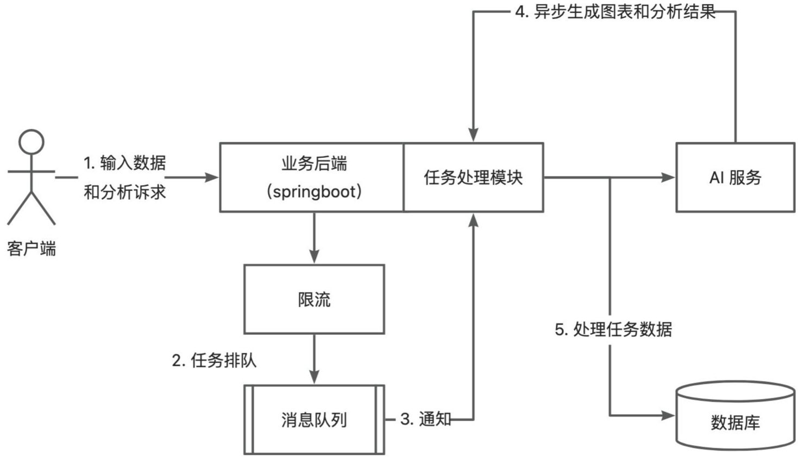


##### 1.4 技术栈


###### 1.4.1 前端


1. React
2. Umi Ant Design Pro
3. 可视化开发库(Echarts+HighCharts+AntV)
4. umi openapi代码生成（自动生成后端调用代码）


###### 1.4.2 后端


1. Spring Boot(万用Java后端项目模板，快速搭建基础框架，避免重复写代码)
2. MySQL数据库
3. MyBatis Plus数据访问框架
4. 消息队列(RabbitMQ)
5. `AI`能力(Open Al接口开发/星球提供现成的`AI`接口)
6. Excel的上传和数据的解析(Easy Excel)
7. Swagger+Knife4j项目接口文档
8. Hutool工具库


#### 2. 项目开发流程


##### 2.1 前端初始化


###### 2.1.1 Ant Design Pro项目搭建


官网：https://pro.ant.design/zh-CN/


我的pro 版本是 `3.1`


直接开干，`pro create xiongbi_frontend`


这次依旧是上 `4`


初始化完成


还是先装依赖，跑起来，`npm install`


完成，直接运行


`dev` 启


出来了，但是没有mock 登不进去，换start


**项目瘦身**


去掉国际化


我的也没报错啊，就不管了【现在已经修复啦，啦啦啦】

删掉国际化文件夹


干掉，然后测试也可以干掉


老项目选手了


项目语言选择删了就行


还能用


###### 2.1.2 初始化模板优化


`.husky`提交代码时，检查是否规范


1. 修改端口

   这个我后端没变，就不改了

2. 删除mock数据（因为本地有后端）

   


3. 替换Logo,去https://www.iconfont.cn/搜索，替换favicon,使用http://libowen.com/tool/ico/生成【也可以直接用png 改 后缀】

   

   

4. 删除国际化locales目录【之前移除后我就删了】

5. 删除测试相关目录【我也删了】

6. types 也可以干掉

   


7. prettier、eslint、editorConfig、stylelint,需要开启prettier美化配置

   

8. jest 也干掉

   


9. 替换网站标题名称：全局替换Ant Design Pro和Ant Design

   

   


##### 2.2 后端初始化


###### 2.2.1 Spring Boot万能模板使用


这里还是使用新版模板，Spring Boot 版本是`2.7.2`


直接复制改个名，idea 打开


改一改模块名，包名，作者 ...


再来个炫酷的banner：


来个数据库


执行建表语句


启动一下项目看看接口文档


这也要记得改


加了个描述，启动吧


改一下JDK 版本即可


启动完成，访问接口文档


没问题，注册一个用户，测试下接口杀杀杀的


一套改，登录一下啊


获取当前登录用户


没问题【帖子就不测了】


###### 2.2.2 数据库表设计


用户表：（居然要改）

```sql
-- 用户表
create table if not exists user
(
    id           bigint auto_increment comment 'id' primary key,
    userAccount  varchar(256)                           not null comment '账号',
    userPassword varchar(512)                           not null comment '密码',
    userName     varchar(256)                           null comment '用户昵称',
    userAvatar   varchar(1024)                          null comment '用户头像',
    userRole     varchar(256) default 'user'            not null comment '用户角色：user/admin',
    createTime   datetime     default CURRENT_TIMESTAMP not null comment '创建时间',
    updateTime   datetime     default CURRENT_TIMESTAMP not null on update CURRENT_TIMESTAMP comment '更新时间',
    isDelete     tinyint      default 0                 not null comment '是否删除',
    index idx_userAccount (userAccount)
) comment '用户' collate = utf8mb4_unicode_ci;
```


图表信息表：（图表表）


```sql
-- 图表信息表
create table if not exists chart
(
    id         bigint auto_increment comment 'id' primary key,
    goal       text                               null comment '分析目标',
    chartData  text                               null comment '图表数据',
    chartType  varchar(128)                       null comment '图表类型',
    genChart   text                               null comment '生成的图表数据',
    genResult  text                               null comment '生成的分析结论',

    userId     bigint                             null comment '创建用户 id',

    createTime datetime default CURRENT_TIMESTAMP not null comment '创建时间',
    updateTime datetime default CURRENT_TIMESTAMP not null on update CURRENT_TIMESTAMP comment '更新时间',
    isDelete   tinyint  default 0                 not null comment '是否删除'
) comment '图表信息表' collate = utf8mb4_unicode_ci;
```


###### 2.2.3 后端基础开发


自动生成后端增删改查代码：

1. 执行SQL语句来建表
2. mybatisX插件生成代码
3. 迁移生成的代码
4. 复制老的增删改查模板，根据的表重构
5. 根据接口文档来测试


直接运行建表语句，之前的用户表要干掉


全部干掉


就要这两个就行


祭出代码生成器，


finish


都在这儿了，然后就是挪挪挪【UserService 和 实现类 保留了模板的】


ID 的自动生成方式改了


还有逻辑删除的注解


`Chart` 实体类表同理


这里删了


我就注掉，不删了


Mapper xml文件的包名记得改


5 对魂斗罗，wx 开发包也直接干了


controller 也干掉


能跑起来就OK

再试一次注册登录


擦，没了


哦哦哦，我刚刚改了包名


好了


注册


登录


获取当前登录用户


没问题


Chart 的增删改查做好，复制post 的就行


然后这个Chart 不需要封装类


> 幸好我看了笔记，用户ID 已经有了


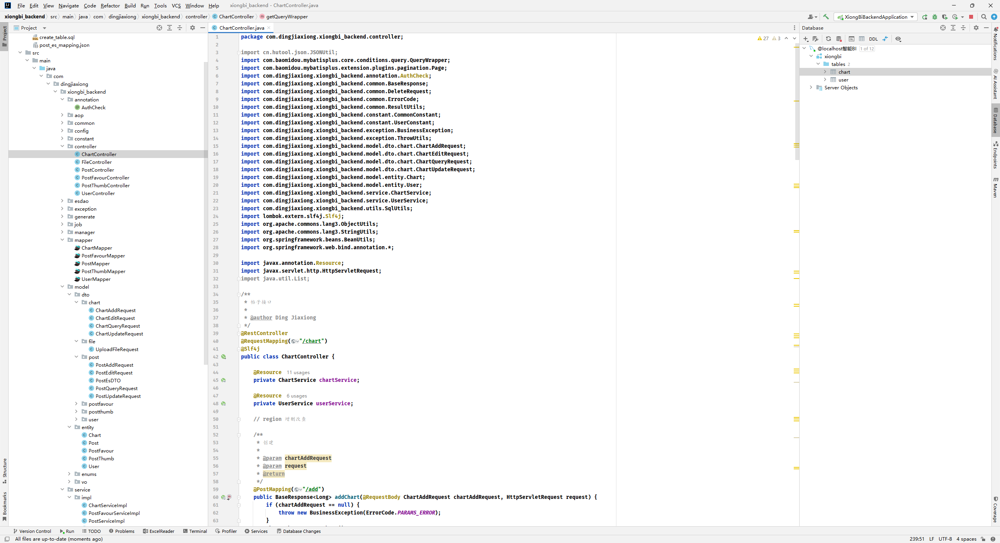


改半天，接口文档测试一下


创建图表


根据ID 获取


分页获取


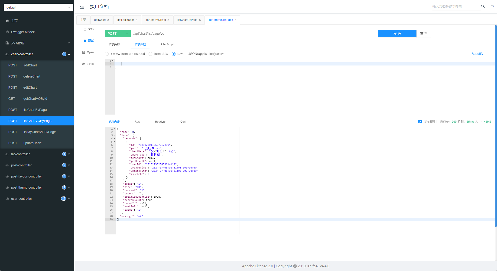


没问题


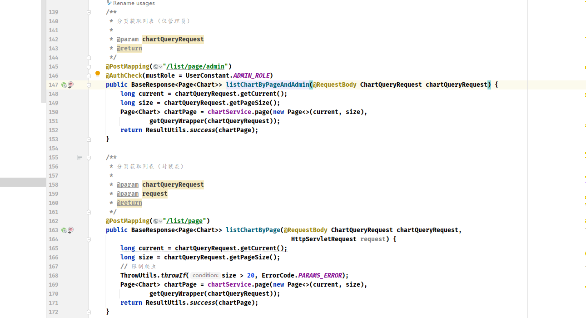


`VO` 字眼删掉了【当然鱼皮的没有那个仅管理员可用的接口，这里随便改改了】


##### 2.3 前后端开发


###### 2.3.1 前后端联调


使用ant design pro自带的openapi工具，根据后端的swagger接口文档数据自动生成对应的请求service代码。

注意：前端须更改对应的请求地址为你的后端地址，方法：在`app.tsx`里修改`request.baseURL`


用openapi 直接生成前端代码


接口文档：http://localhost:8101/api/v2/api-docs


运行生成命令


生成成功。


修改下baseURL 和 带上cookie 进行请求


随便请求测试一下


没问题，能调了


##### 2.4 前端开发


###### 2.4.1 前端开发登录注册页面


这里就是修改修改页面就行，然后修改登录参数

先删掉不需要的，再根据后端去做调整（和后端联调）


输入账号密码登录


这里把之前的用户中心的注册页拿过来，要稍微改吧改吧，其实还是有点不一样的，之前的用户中心用的是 `umi 3` 做的

这里我就直接用登录页进行修改了


这里其实登录有点小问题，进来的时候头像会转圈，刷新一下就没事儿了【这里后面应该会发现问题的】


这里先把那个退出登录改掉


##### 2.5 智能分析业务


###### 2.5.1 业务流程梳理和开发接口概念


**业务流程**


1. 用户输入

    - 分析目标
    - 上传原始数据(excel)
    - 更精细化地控制图表：比如图表类型、图表名称等

2. 后端校验

    - 校验用户的输入是否合法（比如长度）
    - 成本控制（次数统计和校验、鉴权等）

3. 把处理后的数据输入给`AI`模型（调用`AI`接口，星球内部同学可以免费使用`AI`接口），让`AI`模型给我们提供图表信息、结论文本【这里用到的是鱼厂的 `鱼聪明`】

   

4. 图表信息（是一段json配置，是一段代码）、结论文本在前端进行展示


**开发接口**


给chart表补充name字段


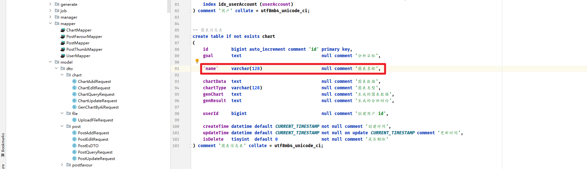


直接OK


再修改一下其他必要的文件，实体类，mapper 文件


根据用户的输入（文本和文件），最后返回图表信息和结论文本


###### 2.5.2 开发接口（原始数据压缩）


`AI`接口普遍都有输入字数限制，尽可能压缩数据，能够允许多传一些数据


如何向`AI` 提词（prompt）：


`AI`提词技巧1：持续输入，持续优化


`AI`提词技巧2：数据压缩（内容压缩，比如把很长的内容提取关键词，也可以让`AI`来做）


使用`AI` 来压缩：


使用`csv`对`excel`文件的数据进行提取和压缩

开源库：https://easyexcel.opensource.alibaba.com/docs/current/


写一个工具类


接口中使用就要修改一下啊


接口文档测试：


没问题。


###### 2.5.3 开发接口（调用AI）


**调用`AI`**


输入：

系统预设 (提前告诉他职责、功能、回复格式要求)+分析目标+压缩后的数据

最简单的系统预设：你是一个数据分析师，接下来我会给你我的分析目标和原始数据，请告诉我分析结论。


`AI`提词技巧3：在系统（模型）层面做预设效果一般来说，会比直接拼接在用户消息里效果更好一些。


有无预设效果对比：


`AI`提词技巧4：除了系统预设外，额外关联一问一答两条消息，相当于给`AI`一个提示。【上下文记忆】


###### 2.5.4 AI生成内容方法（生成结论）


示例问法：


```
你是一个数据分析师，请帮我分析网站用户的增长趋势
原始数据如下：
日期，用户数
1号，10
2号，20
3号，30
```


现在模型好像更厉害了一些


###### 2.5.5 AI生成内容方法（生成图表和AI提问技巧）


**生成图表**


`AI`无法直接生成现成的图表，但是`AI`可以生成图表代码=>可以把代码利用前端的组件库(Echarts)在网页进行展示【其实`GPT-4o` 已经可以了】


echarts支持在线调试：https://echarts.apache.org/examples/zh/editor.html?c=line-simple

预期生成的图表代码：


```javascript
option = {
  xAxis: {
    type: 'category',
    data: ['Mon', 'Tue', 'Wed', 'Thu', 'Fri', 'Sat', 'Sun']
  },
  yAxis: {
    type: 'value'
  },
  series: [
    {
      data: [150, 230, 224, 218, 135, 147, 260],
      type: 'line'
    }
  ]
};
```


**AI提问技巧**


如果想要`AI`更好地理解我们的输入，给我们预期的、精确格式的输出，我们就需要严格控制咱们的提问词。


1. 使用系统预设


2. 控制输入格式（便于AI 精确地理解我们的需求）


比如：


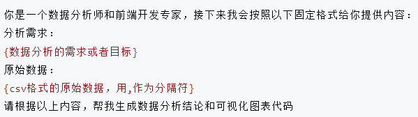


用户提问：


3. 控制输出格式（便于AI返回的内容能够更加方便地为我们所用）


`Prompt` 预设：


```
你是一个数据分析师和前端开发专家，接下来我会按照以下固定格式给你提供内容：
分析需求：
(数据分析的需求或者目标}
原始数据：
{csv格式的原始数据，用，作为分隔符]
请根据这两部分内容，按照以下指定格式生成内容（此外不要输出任何多余的开头、结尾、注释）
【【【【【
{前端Echarts V5的option配置对象js代码，合理地将数据进行可视化，不要生成任何多余的内容，比如注释}
【【【【【
(明确的数据分析结论、越详细越好，不要生成多余的注释}
```


```
分析需求：
分析网站用户的增长情况
原始数据：
日期，用户数
1号，10
2号，20
3号，30
```


还行


能用


4. 指定一个示例问答，one-shot 或者few-shot


> 这个现在好像行了


预设用户：

```
分析需求：
分析网站用户的增长情况
原始数据：
日期，用户数
1号，10
2号，20
3号，30
```


助手：


```
【【【【【
{
  "title": {
    "text": "用户增长情况"
  },
  "tooltip": {
    "trigger": "axis"
  },
  "legend": {
    "data": ["用户数"]
  },
  "toolbox": {
    "feature": {
      "saveAsImage": {}
    }
  },
  "xAxis": {
    "type": "category",
    "data": ["1号", "2号", "3号"]
  },
  "yAxis": {
    "type": "value"
  },
  "series": [
    {
      "name": "用户数",
      "type": "line",
      "data": [10, 20, 30]
    }
  ]
}
【【【【【
根据数据分析，用户数从1号到3号呈现线性增长，每天增长约10个用户。具体来看，1号有10个用户，2号增长到20个用户，3号进一步增长到30个用户。如果这种增长趋势持续，可以预测未来用户数将继续以每天10个的速度增长。
```


再试一次

```
分析需求：
分析网站用户的增长情况
原始数据：
日期，用户数
1号，10
2号，20
3号，50
```


###### 2.5.6 3种调用AI的方式


1. 直接调用官方接口


比如`OpenAI`或者其他`AI`原始大模型官网的接口：


官方文档：https://platform.openai.com/docs/api-reference/introduction


优点：不经封装，最灵活，最原始

缺点：要钱、要魔法

本质上`OpenAI`就是提供了HTTP接口，我们可以用任何语言去调用


- 在请求头中指定`OPENAI_API_KEY`

  

- 找到你要使用的接口，比如`AI`对话接口https://platform.openai.com/docs/api-reference/chat/create

  

- 按照接口文档的示例，构造HTTP请求，比如用Hutool工具类、或者HTTPClient


具体示例代码：


2. 使用云服务商提供的封装接口


比如：Azure云

优点：本地都能用

缺点：依然要钱，而且可能比直接调用原始的接口更贵


3. 鱼聪明AI开放平台


鱼聪明`AI`提供了现成的SDK来让大家更方便地使用`AI`能力。

鱼聪明`AI`网站：https://yucongming.com/ (也可以直接公众号搜索【鱼聪明AI】移动端使用)

优点：目前不要钱，而且有很多现成的模型(`prompt`系统预设)给大家用

缺点：不完全灵活，但是可以定义自己的模型


SDK文档：https://github.com/liyupi/yucongming-java-sdk


引入SDK：

```xml
<dependency>
    <groupId>com.yucongming</groupId>
    <artifactId>yucongming-java-sdk</artifactId>
    <version>0.0.4</version>
</dependency>
```


修改配置：


对接第三方接口：


单元测试：


结果：


可以，这个助手是调好 了的，在接口层使用


执行测试一下：


###### 2.5.7 智能接口开发（后端实现）


**后端流程**


1. 构造用户请求（用户消息、csv数据、图表类型）
2. 调用鱼聪明sdk,得到`AI`响应结果
3. 从`AI`响应结果中，取出需要的信息
4. 保存图表到数据库


测试：


数据库：


还行


最后还加上了给前端返回一个 `chartid`


###### 2.5.8 前端开发（输入表单、生成图表、生成结论）


**输入表单**


文件上传时，注意取出原始对象


**生成图表**


使用库：https://git.hust.cc/echarts-for-react/


`$ npm install echarts-for-react`


**生成结论**


直接展示即可


直接 `openapi` 自动生成前端调用代码

这里还对代码进行了进一步的删减


把表格和自带的service 都删掉了


> 当然这里是直接调的皮总的助手，设定都是可以用的，生成的是json 的代码


###### 2.5.9 前端开发（优化）


优化了前端界面的样式以及加载样式


还不错


后端也插入正常


##### 2.6 图表管理功能


###### 2.6.1 开发图表管理功能


其实就是增删改查。

后端：复用`springboot-init`初始化模板的增删改查代码，核心：获取个人创建的图表列表`listMyChartByPage`


前端：

1. 开发一个列表页
2. 支持按照图表名称搜索


**开发步骤**


1. 创建路由和页面

   

2. 获取需要的数据，定义state变量来存储数据，用于给页面展示

   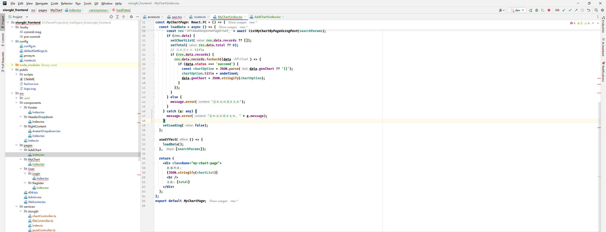

3. 先把最简单直观的数据展示给前端，再去调样式

   

4. 引入Ant Design的List组件，https://ant.design/components/list-cn,复制示例代码

   

5. 调整List组件中的内容为自己的（注意，获取用户头像可以从初始化状态中获取）

6. 针对样式，对数据做一些处理，比如统一隐藏图表自身的`title` 【我这里生成的数据都没有`title`，也判断一下】

   

7. 增加分页

   

8. 增加搜索框

9. 其他优化：比如`loading`效果

   


**小知识**

- 原子化 CSS
- 利用 `F12` 控制台进行弱网测试


**扩展点**

- 支持用户查看原始数据
- 支持跳转到图表编辑页，去编辑图表


##### 2.7 系统分析及优化


###### 2.7.1 系统优化（安全性和数据存储）


**安全性**

如果用户上传一个超大的文件怎么办？比如1000G?

只要涉及到用户自主上传的操作，一定要校验文件（图像）

校验的维度：

- 文件的大小
- 文件的后缀
- 文件的内容（成本要高一些）
- 文件的合规性（比如敏感内容，建议用第三方的审核功能）


> 扩展点：接入腾讯云的图片万象数据审核(COS对象存储的审核功能)


**数据存储**


现状：我们把每个图表的原始数据全部存放在了同一个数据表(chart表)的字段里。

问题：

1. 如果用户上传的原始数据量很大、图表数日益增多，查询Cht表就会很慢。
2. 对于`BI`平台，用户是有查看原始数据、对原始数据进行简单查询的需求的。现在如果把所有数据存放在一个字段（列）中，查询时，只能取出这个列的所有内容。

解决方案=>分库分表：

把每个图表对应的原始数据单独保存为一个新的数据表，而不是都存在一个字段里。


优点：

1. 存储时，能够分开存储，互不影响（也能增加安全性）
2. 查询时，可以使用各种`SQL`语句灵活取出需要的字段，查询性能更快


比如每一个图表的信息用一个表来单独进行存储


**实现**


> 分开存储


1. 存储图表信息时，不把数据存储为字段，而是新建一个`chart_{图表id}`的数据表


通过图表id、数据列名、数据类型等字段，生成以下SQL语句，并且执行即可：


> 分开查询


1. 以前直接查询图表，取chartData字段；现在改为读取`chart_{图表id}`的数据表


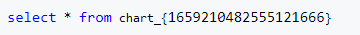


具体实现：MyBatis的动态SQL(根据代码灵活地动态生成)


- 想清楚哪些是需要动态替换的，比如要查询的数据表名`chart_{1659210482555121666}`
- 在`ChartMapper.xml`中定义sql语句


以下这种方式最灵活，但是要小心SQL注入风险：


比如：`select * from chart_12345 where id=1 or 1=1;`


在ChartMapper中定义方法，方法名和上一步的select的id相同：


测试调用：


**分库分表**


- 水平分表（`Sharding`）

  水平分表是将同一张表中的数据按一定的规则划分到不同的物理存储位置上，以达到分摊单张表的数据及访问压力的目的。对于SQL分为两类：`id-based`分表和`range-based`分表。
  水平分表的优点：

    - 单个表的数据量减少，查询效率提高；
    - 可以通过增加节点，提高系统的扩展性和容措性。

  水平分表的缺点：

    - 事务并发处理复杂度增加，需要增加分布式事务的管理，性能和复杂度都有所栖牲：
    - 跨节点查询困难，需要设计跨节点的查询模块。

- 垂直分库（`Vertical Partitioning`)

  在大型互联网应用中，为了应对高并发、海量数据等挑战，往往需要对数据库进行拆分。常见的拆分方式有水平分表和垂直分库两种。

  垂直分库，指的是根据业务模块的不同，将不同的字段或表分到不同的数据库中。垂直分库基于数据库内核支特，对应用透明，无需额外的开发代码，易于维护升级。
  垂直分库的优点：

    - 减少单个数据库的数据量，提高系统的查询效率
    - 增加了系统的可扩展性，比水平分表更容易实现。

  垂直分库的缺点：

    - 不同数据库之间的维护和同步成本较高；
    - 现有系统的改造存在一定的难度；
    - 系统的性能会受到数据库之间互相影响的影响。


需要根据实际的业务场景和技术架构情况，综合考虑各种因素来选择适合自己的分库分表策略。


###### 2.7.2 系统优化（限流算法介绍和实现方式）


现在的问题：使用系统是需要消耗成本的，用户有可疯狂刷量，让你破产。

解决问题：

1. 控制成本=>限制用户调用总次数
2. 用户在短时间内疯狂使用，导致服务器资源被占满，其他用户无法使用=>限流

思考限流阈值多大合适？参考正常用户的使用，比如限制单个用户在每秒只能使用1次。


**限流的几种算法**

文章：https://juejin.cn/post/6967742960540581918


1. 固定窗口限流

   单位时间内允许部分操作

   1小时只允许10个用户操作

    - 优点：最简单
    - 缺点：可出现流量突刺

   比如：前59分钟没有1个操作，第59分钟来了10个操作；第1小时01分钟又来了10个操作。相当于2分钟内执行了20个操作，服务器仍然有高峰危险。

2. 滑动窗口限流

   单位时间内允许部分操作，但是这个单位时间是滑动的，需要指定一个滑动单位

   比如滑动单位1min:
   开始前：
   0s 1h 2h
   一分钟后：
   1min 1h1min

   优点：能够解决上述流量突刺的问题，因为第59分钟时，限流窗口是59分~1小时59分，这个时间段内只能接受10次请求，只要还在这个窗口内，更多的操作就会被拒绝。

   缺点：实现相对复杂，限流效果和你的滑动单位有关，滑动单位越小，限流效果越好，但往往很难选取到一个特别合适的滑动单位。

3. 漏桶限流（推荐）

   以固定的速率处理请求（漏水），当请求桶满了后，拒绝请求。

   每秒处理10个请求，桶的容量是10，每0.1秒固定处理一次请求，如果1秒内来了10个请求；都可以处理完，但如果1秒内来了11个请求，最后那个请求就会溢出桶，被拒绝。

   优点：能够一定程度上应对流量突刺，能够固定速率处理清求，保证服务器的安全

   缺点：没有办法迅速处理一批请求，只能一个一个按顺序来处理（固定速率的缺点）

4. 令牌桶限流（推荐）

   管理员先生成一批令牌，每秒生成10个令牌；当用户要操作前，先去拿到一个令牌，有令牌的人就有资格执行操作、能同时执行操作；拿不到令牌的就等着

   优点：能够并发处理同时的请求，并发性能会更高

   需要考虑的问题：还是存在时间单位选取的问题


**限流粒度**


1. 针对某个方法限流，即单位时间内最多允许同时 XX 个操作使用这个方法
2. 针对某个用户限流，比如单个用户单位时间内最多执行 XX 次操作
3. 针对某个用户x方法限流，比如单个用户单位时间内最多执行 XX 次这个方法


**限流的实现**


1. 本地限流（单机限流）

   每个服务器单独限流，一般适用于单体项目，就是你的项目只有一个服务器。

   Guava RateLimiter：

   

2. 分布式限流（多机限流）

   如果你的项目有多个服务器，比如微服务，那么建议使用分布式限流。

    1. 把用户的使用频率等数据放到一个集中的存储进行统计，比如Redis,这样无论用户的请求落到了哪台服务器，都以集中的数据存储内的数据为准( `Redisson` - 是一个操作Redis的工具库，伙伴匹配系统讲过)

    2. 在网关集中进行限流和统计（比如Sentinel、Spring Cloud Gateway)

       


###### 2.7.3 Redisson 分布式限流实战


**Redisson 限流实现**


Redisson内置了一个限流工具类，可以帮助你利用Redis来存储、来统计。

官方项目仓库和文档：https://github.com/redisson/redisson


> 小知识：没办法看懂方法参数的含义，怎么办？
>
> 1. 看文档
> 2. 下载源码


步骤：

0. 本地安装Redis

   

1. 引入Redisson 依赖

   ```xml
   <!-- https://github.com/redisson/redisson#quick-start -->
   <dependency>
       <groupId>org.redisson</groupId>
       <artifactId>redisson</artifactId>
       <version>3.21.3</version>
   </dependency>
   ```

   

2. 创建RedissonConfig配置类，用于初始化RedissonClient对象单例：

   

   

3. 编写RedisLimiterManager

   什么是Manager?专门提供RedisLimiter限流基础服务的（提供了通用的能力，可以放到任何一个项目里）

   


4. 单元测试

   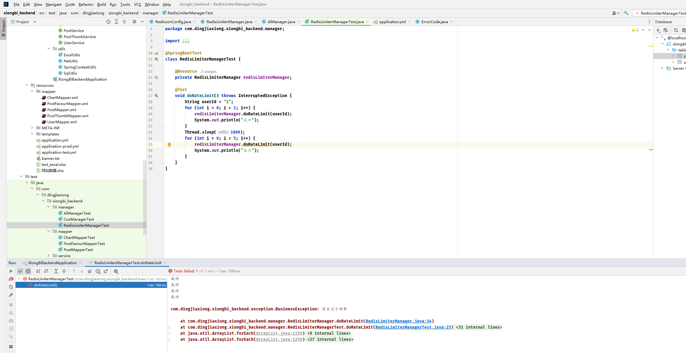

5. 应用到要限流的方法中，比如智能分析接口

   


##### 2.8 系统异步化


###### 2.8.1 内容介绍、系统问题分析、异步化概念


**系统问题分析**


问题场景：调用的服务处理能力有限，或者接口的处理（或返回）时长较长时，就应该考虑异步化了。

1. 用户等待时间有点长（因为要等`AI`生成）
2. 业务服务器可会有很多请求在处理，导致系统资源紧张，严重时导致服务器宕机或者无法处理新的请求
3. 调用的第三方服务(`AI`能力)的处理能力是有限的，比如每3秒只能数处理1个请求，会导致`AI`处理不过来，严重时`AI`可能会对咱们的后台系统拒绝服务。


**异步化**


new Thread?

同步：一件事情做完，再做另外一件事情。（烧水后处理工作）

异步：不用等一件事做完，就可以做另外一件事情。等第一件事完成时，可以收到一个通知，通知你这件事做好了，你可以再进行后续处理。（烧水的时候，水壶有一个蜂鸣器；烧水时人可以同时处理工作。水烧好后，人听到声音，就知道水烧好了)


###### 2.8.2 异步化（业务流程分析）


**标准异步化的业务流程**


1. 当用户要进行耗时很长的操作时，点击提交后，不需要在界面傻等，而是应该把这个任务保存到数据库中记录下来
2. 用户要执行新任务时：
    - 任务提交成功：
        - 如果我们的程序还有多余的空闲线程，可以立刻去做这个任务
        - 如果我们的程序的线程都在繁忙，无法继续处理，那就放到等待队列里
    - 任务提交失败：比如我们的程序所有线程都在忙，任务队列满了
        - 拒绝掉这个任务，再也不去执行
        - 通过保存到数据库中的记录来看到提交失败的任务，并且在程序闲的时候，可以把任务从数据库中捞到程序里，再去执行
3. 我们的程序（线程）从任务队列中取出任务依次执行，每完成一件事情要修改一下的任务的状态。
4. 用户可以查询任务的执行状态，或者在任务执行成功或失败时能得到通知（发邮件、系统消息提示、短信），从而优化体验
5. 如果我们要执行的任务非常复杂，包含很多环节，在每一个小任务完成时，要在程序（数据库中）记录一下任务的执行状态（进度）


**我们系统的业务流程**


1. 用户点击智能分析页的提交按钮时，先把图表立刻保存到数据库中（作为一个任务）
2. 用户可以在图表管理页面查看所有图表（已生成的、生成中的、生成失败）的信息和状态
3. 用户可以修改生成失败的图表信息，点击重新生成


优化流程（异步化）：


问题：

1. 任务队列的最大容量应该设置为多少？
2. 程序怎么从任务队列中取出任务去执行？这个任务队列的流程怎么实现？怎么保证程序最多同时执行多少个任务？


###### 2.8.3 线程池的实现、参数、工作机制、参数设置


**线程池**


为什么需要线程池？

1. 线程的管理比较复杂（比如什么时候新增线程、什么时候减少空闲线程）
2. 任务存取比较复杂（什么时候接受任务、什么时候拒绝任务、怎么保证大家不抢到同一个任务）

线程池的作用：帮助你轻松管理线程、协调任务的执行过程。


**线程池的实现**


不用自己写，如果是在Spring中，可以用ThreadPoolTaskExecutor配合`@Async`注解来实现。（不太建议）

如果是在`Java`中，可以使用`JUC`并发编程包中的 `ThreadPoolExecutor` 来实现非常灵活地自定义线程池。


**线程池的参数**

怎么确定线程池参数呢？结合实际情况（实际业务场景和系统资源）来测试调整，不断优化。

回归到我们的业务，要考虑系统最脆弱的环节 (系统的瓶颈) 在哪里？

现有条件：比如`AI`生成能力的并发是只允许4个任务同时去执行，`AI`能力允许20个任务排队。


- `corePoolSize`(核心线程数=>正式员工数)：正常情况下，我们的系统应该同时工作的线程数（随时就绪的状态）
- `maximumPoolSize`(最大线程数=>哪怕任务再多，你也最多招这些人)：极限情况下，我们的线程池最多有多少个线程？
- `keepAliveTime`(空闲线程存活时间)：非核心线程在没有任务的情况下，过多久要删除（理解为开除临时工），从而释放无用的线程资源。
- `TimeUnit unit`(空闲线程存活时间的单位)：分钟、秒
- `workQueue`(工作队列)：用于存放给线程执行的任务，存在一个队列的长度（一定要设置，不要说队列长度无限，因为也会占用资源）
- `threadFactory`(线程工厂)：控制每个线程的生成、线程的属性（比如线程名）
- `RejectedExecutionHandler`(拒绝策略)：任务队列满的时候，我们采取什么措施，比如抛异常、不抛异常、自定义策略


> 资源隔离策略：比如重要的任务(VIP任务)一个队列，普通任务一个队列，保证这两个队列互不干扰。


**线程池的工作机制**

刚开始，没有任何的线程，也没有任何的任务：


来了一个任务，发现我们的员工还没有达到正式员工数(corePoolSize=2)，来一个员工直接处理这个任务


又来了一个任务，发现我们的员工还没有达到正式员工数(corePoolSize=2),再来一个员工直接处理这个任务


又来了一个任务，但是我们正式员工数已经满了（当前线程数=corePoolSize=2),任务放到队列（最大长度workQueue.size是2）里等待，而不是再加新员工。


又来了一个任务，但是我们的任务队列已经满了（当前线程数>corePoolSize=2,已有任务数=最大长度workQueue.size=2),新增线程(maximumPoolSize=4)来处理新任务，而不是丢弃任务


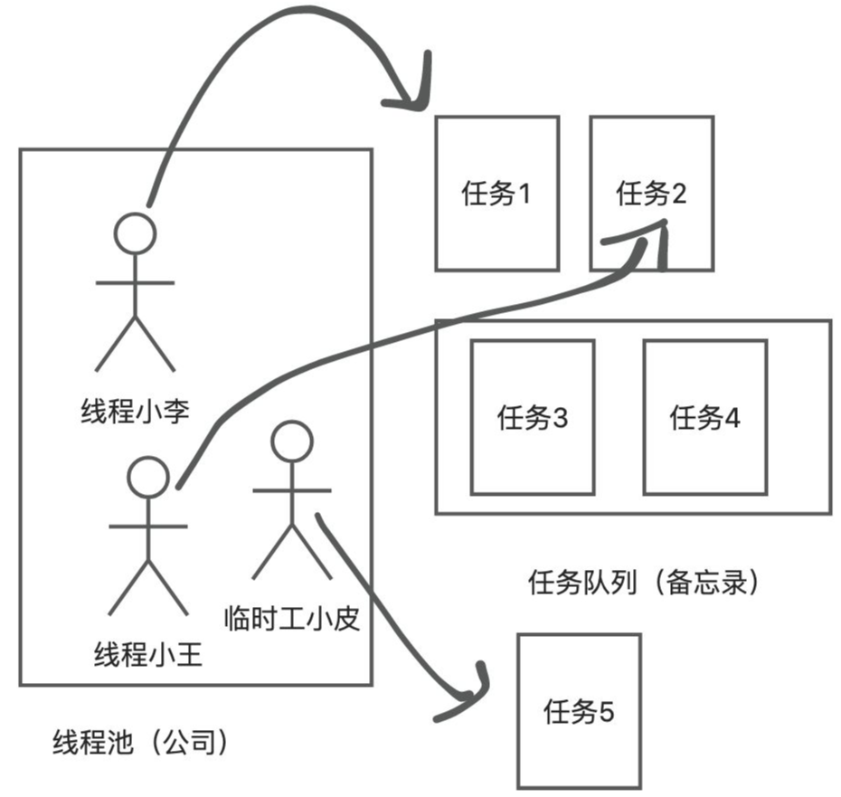


已经到了任务7，但是我们的任务队列已经满了、临时工也招满了（当前线程数=maximumPoolSize=4,已有任务数=最大长度workQueue.size=2),调用RejectedExecutionHandler拒绝策略来处理多余的任务。


如果当前线程数超过corePoolSize(正式员工数)，又没有新的任务给他，那么等keepAliveTime时间达到后，就可以把这个线程释放。


**线程池的参数如何设置？**


现有条件：比如`AI`生成能力的并发是只允许4个任务同时去执行，`AI`能力允许20个任务排队。


- corePoolSize(核心线程数=>正式员工数)：正常情况下，可以设置为 `2-4`
- maximumPoolSize:设置为极限情况，设置为 `<=4`
- keepAliveTime(空闲线程存活时间)：一般设置为秒级或者分钟级
- TimeUnit unit(空闲线程存活时间的单位)：分钟、秒
- workQueue(工作队列)：结合实际请况去设置，可以设置为 `20`
- threadFactory(线程工厂)：控制每个线程的生成、线程的属性（比如线程名）
- RejectedExecutionHandler(拒绝策略)：抛异常，标记数据库的任务状态为"任务满了已拒绝"


一般情况下，任务分为`IO`密集型和计算密集型两种。


- 计算密集型：吃CPU,比如音视频处理、图像处理、数学计算等，一般是设置corePoolSiz为CPU的核数+1（空余线程），可以让每个线程都能利用好CPU的每个核，而且线程之间不用频繁切换（减少打架、减少开销）
- `IO`密集型：吃带宽/内存/硬盘的读写资源，corePoolSize可以设置大一点，一般经验值是2n左右，但是建议以`IO`的能力为主。


考虑导入百万数据到数据库，属于IO密集型任务、还是计算密集型任务？


###### 2.8.4 线程池的开发和实现


自定义线程池


提交任务到线程池：


查看线程池状态：


测试一下：【直接用接口文档】


第三个任务进


并没有执行中，


放到了队列里面，把队列放满


再来一个的时候，7


临时工来了，再来一个任务


手误，忘记改了，应该是任务8


现在都满了，临时工也不能再招了


系统错误，这个就是拒绝了


**开发** 【实现工作流程】


1. 给chart表新增任务状态字段（比如排邦队中、执行中、已完成、失败），任务执行信息字段（用于记录任务执行中、或者失败的一些信息）
2. 用户点击智能分析页的提交按钮时，先把图表立刻保存到数据库中，然后提交任务
3. 任务：先修改图表任务状态为”执行中”。等执行成功后，修改为“已完成”、保存执行结果；执行失败后，状态修改为”失败”，记录任务失败信息。
4. 用户可以在图表管理页面查看所有图表（已生成的、生成中的、生成失败）的信怎和状态


###### 2.8.5 线程池优化


**库表设计**

`chart`表新增字段：


```sql
status      varchar(128)                       not null default 'wait' comment 'wait,running,succeed,failed',
execMessage text                               null comment '执行信息',
```


记得修改实体类 还有mapper 文件


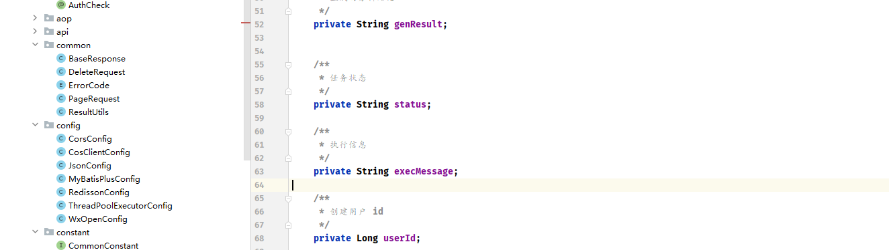


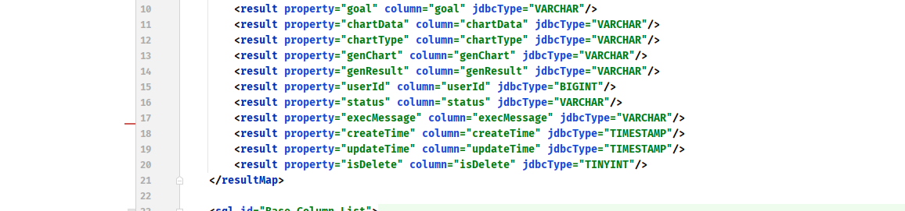


**任务执行逻辑**


先修改任务状态为执行中，减少重复执行的风险、同时让用户知道执行状态。

注意异常处理：这里新开了一个接口【取名异步】：


这里因为异步了，不能立刻返回分析信息了，所以新增一个页面来测试效果


**前端开发**


1. 复制一个异步创建图表页面
2. 修改一下调用的接口为异步接口
3. 移除无用元素和变量
4. 修改成功后的操作，比如提示语和重置表单
5. 调整我的图表页面，补充错误处理
6. 调整图表的查询顺序，按照创建时间降序


提示文案也要改。


下面是修改一下，展示图表生成的状态信息


试一个


没问题，加一层判断， 只有分析成功才解析`JSON`


**一些优化点**


1. 给任务的执行增加guava Retrying重试机制，保证系统可靠性。
2. 提前考虑到`AI`生成错误的情况，在后端进行异常处理（比如`AI`说了多余的话，提取正确的符串）
3. 如果说任务根本没提交到队列中（或者队列满了），是不是可以用定时任务把失败状态的图表放到队列中（补偿）
4. 建议给任务的执行增加一个超时时间，超时自动标记为失败（超时控制）
5. 反向压力：https://zhuanlan.zhihu.com/p/404993753,通过调用的服务状态来选择当前系统的策略（比如根据Al服务的当前任务队列数来控制咱们系统的核心线程数），从而最大化利用系统资源。
6. 我的图表页面增加一个刷新、定时自动刷新的按钮，保证获取到图表的最新状态（前端轮询）
7. 任务执行成功或失败，给用户发送实时消息通知（实时：websocket、server side event)


##### 2.9 系统现状分析


###### 2.9.1 分析系统不足


> 单机系统的问题


已经经过了同步到异步的改造？

现状：目前的异步是通过本地的线程池实现的。

【1】无法集中限制，只能单机限制

假如`AI`服务限制只有2个用户同时使用，单个线程池可以限制最大核心线程数为2来实现。

假设系统用量增大，改为分布式，多台服务器，每个服务器都要有2个线程，就有可能有2N个线程，超过了`AI`服务的限制。

解决方案：在一个集中的地方去管理下发任务（比如集中存储当前正在执行的任务数）

【2】任务由于是放在内存中执行的，可能会丢失

虽然可以人工从数据库捞出来再重试，但是其实需要额外开发（比如定时任务），这种重试的场景是非常典型的，其实是不需要我们开发者过于关心、或者自己实现的。

解决方案：把任务放在一个可以持久化存储的硬盘

【3】优化：如果你的系统功能越来越多，长耗时任务越来越多，系统会越来越复杂（比如要开多个线程池、资源可能会出现项目抢占）。

服务拆分（应用解耦）：其实我们可以把长耗时、消耗很多的任务把它单独抽成一个程序，不要影响主业务。

解决方案：可以有一个中间人，让中间人帮我们去连接两个系统（比如核心系统和智能生成业务）


##### 2.10 分布式消息队列


###### 2.10.1 中间件、消息队列、模型


**中间件**


连接多个系统，帮助多个系统紧密协作的技术（或者组件）。

比如：Redis、消息队列、分布式存储Etcd


**消息队列**


存储消息的队列。

关键词：存储、消息、队列

存储：存数据

消息：某种数据结构，比如字符串、对象、二进制数据、`JSON`等等

队列：先进先出的数据结构

消息队列是特殊的数据库么？

可以这么理解。

应用场景（作用）：在多个不同的系统、应用之间实现消息的传输（也可以存储）。不需要考虑传输应用的编程语言、系统、框架等等。

可以让`java`开发的应用发消息，让php开发的应用收消息，这样就不用把所有代码写到同一个项目里（应用解耦）。


**消息队列的模型**


生产者：Producer,类比为快递员，发送消息的人（客户端）

消费者：Consumer,.类比为取快递的人，接受读取消息的人（客户端）

消息：Message,类比为快递，就是生产者要传输给消费者的数据

消息队列：Queue

为什么不接传输，要用消息队列？生产者不用关心你的消费者要不要消费、什么时候消费，我只需要把东西给消息队列，我的工作就算完成了。

生产者和消费者实现了解耦，互不影响。


**为什么要用消息队列？**


【1】异步处理

生产者发送完消息之后，可以继续去忙别的，消费者想什么时候消费都可以，不会产生阻塞。

【2】削峰填谷

先把用户的请求放到消息队列中，消费者（实际执行操作的应用）可以按照自己的需求，慢慢去取。

原本：12点时来了10万个请求，原本情况下，10万个请求都在系统内部立刻处理，很快系统压力过大就宕机了。

现在：把这10万个请求放到消息队列中，处理系统以自己的恒定速率（比如每秒1个）慢慢执行，从而保护系统、稳定处理。


###### 2.10.2 应用场景、缺点、主流消息队列选型


**分布式消息队列的优势**


【1】数据持久化：它可以把消息集中存诸到硬盘里，服务器重启就不会丢失

【2】可扩展性：可以根据需求，随时增加（或减少）节点，继续保持稳定的服务

【3】应用解耦：可以连接各个不同语言、框架开发的系统，让这些系统能够灵活传输读取数据

应用解耦的优点：

以前，把所有功能放到同一个项目中，调用多个子功能时，一个环节错，系统就整体出错：


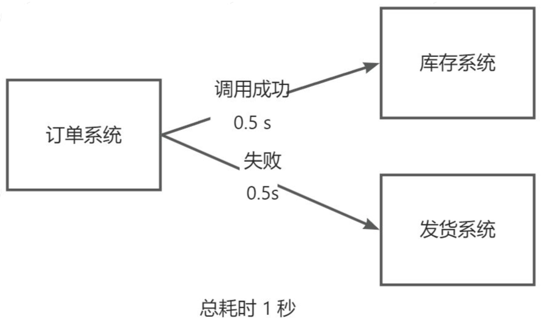


使用消息队列进行解耦：

1. 一个系统挂了，不影响另一个系统

2. 系统挂了并恢复后，仍然可以取出消息，继续执行业务逻辑
3. 只要发送消息到队列，就可以立刻返回，不用同步调用所有系统，性能更高


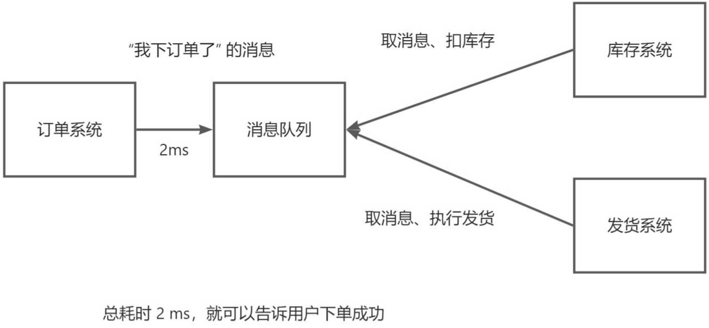


【4】发布订阅

如果一个非常大的系统要给其他子系统发送通知，最简单直接的方式是大系统直接依次调用小系统：

问题：

1. 每次发通知都要调用很多系统，很麻烦、有可失败
2. 新出现的项目（或者说大项目感知不到的项目）无法得到通知


解决方案：大的核心系统始终往一个地方（消息队列）去发消息，其他的系统都去订阅这个消息队列（读取这个消息队列中的消息）


**应用场景**


1. 耗时的场景（异步）
2. 高并发场景（异步、削峰填谷）
3. 分布式系统协作（尤其是跨团队、跨业务协作，应用解耦）
4. 强稳定性的场景（比如金融业务，持久化、可靠性、削峰填谷）


**消息队列的缺点**


要给系统引入额外的中间件，系统会更复杂、额外维护中间件、额外的费用（部署）成本

消息队列：消息丢失、顺序性、重复消费、数据的一致性（分布式系统就要考虑）

> 也可以叫分布式场景下需要考虑的问题


**主流分布式消息队列选型**


【主流技术】


1. activemq
2. rabbitmg
3. kafka
4. rocketmq
5. zeromq
6. pulsar(云原生)
7. Apache InLong (Tube)


【技术对比】

技术选型指标：

- 吞吐量：IO、并发
- 时效性：类似延迟，消息的发送、到达时间
- 可用性：系统可用的比率（比如1年365天宕机1s,可用率大概X个9）
- 可靠性：消息不丢失（比如不丢失订单）、功能正常完成


###### 2.10.3 基本概念、安装、快速入门（单向）


【`RabbitMQ` 入门实战】


特点：生态好，好学习、易于理解，时效性强，支特很多不同语言的客户端，扩展性、可用性都很不错。

学习性价比非常高的消息队列，适用于绝大多数中小规模分布式系统。


官方网站：https://www.rabbitmq.com/tutorials


**基本概念**


`AMQP` 协议：https://www.rabbitmq.com/tutorials/amqp-concepts


高级消息队列协议(Advanced Message Queue Protocol)

生产者：发消息到某个交换机

消费者：从某个队列中取消息

交换机(Exchange):负责把消息转发到对应的队列

队列(Queue):存储消息的

路由(Routes)：转发，就是怎么把消息从一个地方转到另一个地方（比如从生产者转发到某个队列）


**安装**


快速开始：https://www.rabbitmq.com/#getstarted

Windows 安装：https://www.rabbitmq.com/docs/install-windows | https://github.com/rabbitmq/rabbitmq-server/releases/download/v3.13.4/rabbitmq-server-3.13.4.exe


先装`erlang 25.3.2`，RabbitMQ 依赖 erlang，这个语言的性能非常高。


这玩意儿要注意版本关系【我需要一个`26` 往上走的】直接最新版吧


erlang 下载：https://www.erlang.org/patches/otp-25.3.2


https://www.erlang.org/patches/otp-27.0.1 今天是`2024年7月15日10:53:42`


安装完erlang后，安装rabbitmq即可。


直接启动

command+r打开`services.msc`(服务菜单)，查看rabbitmq服务是否已启动：


安装rabbitmg监控面板：

在rabbitmq安装目录的sbin中执行下述脚本：


```
rabbitmq-plugins.bat enable rabbitmq_management
```


输出：


访问：http://localhost:15672/


这里拒绝了，重启一下MQ 服务


出来了，用户名密码都是 `guest`


这玩意儿的解决办法：


全部启用就行了


这里为了保险起见，我把版本退回去了。


RabbitMQ 版本：`3.12.0`：https://github.com/rabbitmq/rabbitmq-server/releases/download/v3.12.0/rabbitmq-server-3.12.0.exe

Erlang 版本：`25.3.2`：https://www.erlang.org/patches/otp-25.3.2


如果想要在远程服务器安装访问rabbitmq管理面板，你要自己创建一个管理员账号，不能用默认的guest,否则会被拦截（官方出于安全考虑）。

如果被拦截，可以自己创建管理员用户：https://www.rabbitmq.com/docs/access-control


`rabbitmq` 端口占用：

- `5672` :程序连接的端☐
- `15672` :webUl


**快速入门**

MQ 官方教程：https://www.rabbitmq.com/tutorials


【单向发送】

> Hello World


文档：https://www.rabbitmq.com/tutorials/tutorial-one-java

一个生产者给一个队列发消息，一个消费者从这个队列取消息。1对1。


引入消息队列Java 客户端依赖：

```xml
<!-- https://mvnrepository.com/artifact/com.rabbitmq/amqp-client -->
<dependency>
    <groupId>com.rabbitmq</groupId>
    <artifactId>amqp-client</artifactId>
    <version>5.17.0</version>
</dependency>
```


生产者代码：


Channel频道：理解为操作消息队列的client(比如jdbcClient、.redisClient),提供了和消息队列server建立通信的传输方法（为了复用连接，提高传输效率）。程序通过channel操作rabbitmq(收发消息)

创建消息队列：

参数：

- queueName:消息队列名称（注意，同名称的消息队列，只能用同样的参数创建一次）
- durabale:消息队列重启后，消息是否丢失
- exclusive:是否只允许当前这个创建消息队列的连接操作消息队列
- autoDelete:没有人用队列后，是否要删除队列


执行程序后，可以看到有1条消息：


消费者代码：


启动消费者后，可以看到消息被消费了 ：


再生产一个，马上就会被消费


###### 2.10.4 快速入门（多消费者）


官方教程：https://www.rabbitmq.com/tutorials/tutorial-two-java

场景：多个机器同时去接受并处理任务（尤其是每个机器的处理能力有限）

一个生产者给一个队列发消息，多个消费者从这个队列取消息。1对多。


【1】队列持久化


durable参数设置为true,服务器重启后队列不丢失：


【2】消息持久化


指定`MessageProperties.PERSISTENT_TEXT_PLAIN`参数：


生产者代码：使用Scanner接受用户输入，便于发送多条消息


控制单个消费者的处理任务积压数：

每个消费者最多同时处理1个任务


消息确认机制：

为了保证消息成功被消费（快递成功被取走），rabbitmq提供了消息确认机制，当消费者接收到消息后，比如要给一个反馈：

- ack:消费成功
- nack:消费失败
- reject:拒绝

如果告诉rabbitmq服务器消费成功，服务器才会放心地移除消息。

支持配置autoack,会自动执行ack命令，接收到消息立刻就成功了。


建议autoack改为`false`,根据实际情况，去手动确队。


指定确认某条消息：


第二个参数multiple批量确认：是指是否要一次性确认所有的历史消息直到当前这条

指定拒绝某条消息：


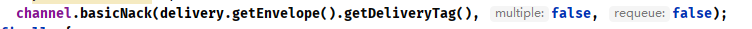


第3个参数表示是否重新入队，可用于重试

消费者代码：


2个小技巧：

1. 使用Scanner接受用户输入，便于快速发送多条消息
2. 使用 for 循环创建多个消费者，便于快速验证队列模型工作机制


###### 2.10.5 快速入门（Fanout 交换机）


教程：https://www.rabbitmq.com/tutorials/tutorial-three-java


一个生产者给多个队列发消息，1个生产者对多个队列。

交换机的作用：提供消息转发功能，类似于网络路由器

要解决的问题：怎么把消息转发到不同的队列上，好让消费者从不同的队列消费。

绑定：交换机和队列关联起来，也可以叫路由，算是一个算法或转发策略

绑定代码：


```
channel.queueBind(queueName2, EXCHANGE_NAME, "绑定规则【路由键】");
```


交换机有多种类别：fanout、direct,topic,headers


**fanout**

扇出、广播

特点：消息会被转发到所有绑定到该交换机的队列

场景：很适用于发布订阅的场景。比如写日志，可以多个系统间共享


示例场景：


生产者代码：


消费者代码：

注意：

1. 消费者和生产者要绑定同一个交换机
2. 要先有队列，才绑定


效果：所有消费者都能收到消息


###### 2.10.6 Direct交换机


官方教程：https://www.rabbitmq.com/tutorials/tutorial-four-java


绑定：可以让交换机和队列进行关联，可以指定让交互机把什么样的消息发送给哪个队列（类以于计算机网络中，两个路由器，或者网络设备相互连接，也可以理解为网线）

routingKey:路由键，控制消息要转发给哪个队列的(IP地址)

特点：消息会根据路由键转发到指定的队列

场景：特定的消息只交给特定的系统（程序）来处理

绑定关系：完全匹配字符串


可以绑定同样的路由键。

比如发日志的场景，希望用独立的程序来处理不同级别的日志，比如C1系统处理error日志，C2系统处理其他级别的日志


示例场景：


> xiaojia 、 xiaoxiong


生产者代码：


消费者代码：


运行效果，分发：


如果没有对应的路由键，丢掉消息。


###### 2.10.7 Topic 和 Headers 交换机


**topic 交换机**

官方教程：https://www.rabbitmq.com/tutorials/tutorial-five-java


特点：消息会根据一个模糊的路由键转发到指定的队列
场景：特定的一类消息可以交给特定的一类系统（程序）来处理
绑定关系：可以模糊匹配多个绑定

- `*`:匹配一个单词，比如`*.orange`,那么`a.orange`、`b.orange`都能匹配
- `#`:匹配0个或多个单词，比如`a.#`,那么`a.a`、`a.b`、`a.a.a`都匹配

注意，这里的匹配和MySQL的k的`%`不一样，只能按照单词来匹配，每个`.`分隔单词，如果是`#`，其实可以忽略，匹配0个词也ok


应用场景：

老板要下发一个任务，让多个组来处理：


生产者代码：


消费者代码：


效果：


> 当然 `需要`、`去做` 这种字眼可以不要， `#` 匹配 `0` 个 或者 多个
>
> 


**headers 交换机**


类以主题和直接交换机，可以根据headers中的内容来指定发送到哪个队列

由于性能差、比较复杂，一般不推荐使用。


`AI`学习连环问：是什么？有什么用？什么场景下会用？有什么优缺点？有没有示例代码？


###### 2.10.8 RPC、消息过期机制、消息确认机制


**RPC**

支特用消息队列来模拟RPC的调用，但是一般没必要，直接用Dubbo、GRPC等RPC框架就好了。

→ 实现一个场景总有更合适的、更专注的技术


**核心特性**


【消息过期机制】

官方文档：https://www.rabbitmq.com/docs/ttl


可以给每条消息指定一个有效期，一段时间内未被消费者处理，就过期了。

示例场景：消费者（库存系统）挂了，一个订单15分钟还没被库存系统处理，这个订单其实已经失效了，哪怕库存系统再恢复，其实也不用扣减库存。

适用场景：清理过期数据、模拟延迟队列的实现（不开会员就慢速）、专门让某个程序处理过期请求


1. 给队列中的所有消息指定过期时间

   ```java
   Map<String, Object> args = new HashMap<String, Object>();
   args.put("x-message-ttl", 60000);
   channel.queueDeclare("myqueue", false, false, false, args);
   ```

   如果在过期时间内，还没有消费者取消息，消息才会过期。

   注意，如果消息已经接收到，但是没确认，是不会过期的。

   > 如果消息处于待消费状态并且过期时间到达后，消息将被标记为过期。但是，如果消息已经被消费者消费，并且正在处理过程中，即使过期时间到达，消息仍然会被正常处理

   消费者代码：

   

   

   生产者示例代码：

   

2. 给某条消息指定过期时间

   语法：

   ```java
   byte[] messageBodyBytes = "Hello, world!".getBytes();
   AMQP.BasicProperties properties = new AMQP.BasicProperties.Builder()
                                      .expiration("60000")
                                      .build();
   channel.basicPublish("my-exchange", "routing-key", properties, messageBodyBytes);
   ```

   示例代码：

   


【消息确认机制】

官方文档：https://www.rabbitmq.com/docs/confirms

为了保证消息成功被消费（快递成功被取走），rabbitmq提供了消息确认机制，当消费者接收到消息后，比如要给一个反馈：

- ack:消费成功
- nack:消费失败
- reject:拒绝

如果告诉rabbitmq服务器消费成功，服务器才会放心地移除消息。

支持配置autoack,会自动执行ack命令，接收到消息立刻就成功了。


**一般情况下，建议autoack改为`false`,根据实际情况，去手动确队。**


指定确认某条消息：


第二个参数multiple批量确认：是指是否要一次性确认所有的历史消息直到当前这条

指定拒绝某条消息：


第3个参数表示是否重新入队，可用于重试


###### 2.10.9 死信队列


【死信队列】


官方文档：https://www.rabbitmq.com/docs/dlx


为了保证消息的可靠性，比如每条消息都成功消费，需要提供一个容错机制，即：失败的消息怎么处理？

死信：过期的消息、拒收的消息、消息队列满了、处理失败的消息的统称

死信队列：专门处理死信的队列（注意，它就是一个普通队列，只不过是专门用来处理死信的，你甚至可以理解这个队列的名称叫“死信队列“）

死信交换机：专门给死信队列转发消息的交换机（注意，它就是一个普通交换机，只不过是专门给死信队列发消息而已，理解为这个交换机的名称就叫“死信交换机”）。也存在路由绑定

死信可以通过死信交换机绑定到死信队列。

示例场景：


实现：


1. 创建死信交换机和死信队列，并且绑定关系

   

2. 给失败之后需要容错处理的队列绑定死信交换机

3. 可以给要容错的队列指定死信之后的转发规则，死信应该再转发到哪个死信队列

4. 可以通过程序来读取死信队列中的消息，从而进行处理


完整生产者代码：


消费者完整代码：


效果：外包和老板分别处理xiaodog xiaocat 拒绝的消息


##### 2.11 RabbitMQ 入门实战


###### 2.11.1 重点知识和RabbitMQ项目实战介绍


> 也是面试考点


1. 消息队列的概念、模型、应用场景
2. 交换机的类别、路由绑定的关系
3. 消息可靠性
    - 消息确认机制(ack、nack、reject)
    - 消息持久化(durable)
    - 消息过期机制
    - 死信队列
4. 延迟队列（类似死信队列）
5. 顺序消费、消费幂等性（本次不讲）
6. 可扩展性（仅作了解）
    - 集群
    - 故障的恢复机制
    - 镜像
7. 运维监控告警（仅作了解）


**相关资源**


- https://juejin.cn/post/7225474899480526885
- https://wx.zsxq.com/dweb2/index/topic_detail/214245214541111


###### 2.11.2 RabbitMQ项目实战


**选择客户端**


怎么在项目中使用RabbitMQ?

【1】使用官方的客户端。

- 优点：兼容性好，换语言成本低，比较灵活

- 缺点：太灵活，要自己去处理一些事情。比如要自己维护管理链接，很麻烦。

【2】使用封装好的客户端，比如Spring Boot RabbitMQ Starter

- 优点：简单易用，直接配置直接用，更方便地去管理连接

- 缺点：封装的太好了，你没学过的话反而不知道怎么用。不够灵活，被框架限制。

根据场景来选择，没有绝对的优劣：类以jdbc和yBatis

本次使用`Spring Boot RabbitMQ Starter`(因为我们是Spring Boot项目)

如果你有一定水平，有基础，英文好，建议看官方文档，不要看过期博客！https://spring.io/guides/gs/messaging-rabbitmq


**基础实战**


【1】引入依赖

注意，使用的版本一定要和你的springboot版本一致！！！！！！！

```xml
<!-- https://mvnrepository.com/artifact/org.springframework.boot/spring-boot-starter-amqp -->
<dependency>
    <groupId>org.springframework.boot</groupId>
    <artifactId>spring-boot-starter-amqp</artifactId>
    <version>2.7.2</version>
</dependency>
```


【2】在 `yml` 中引入配置


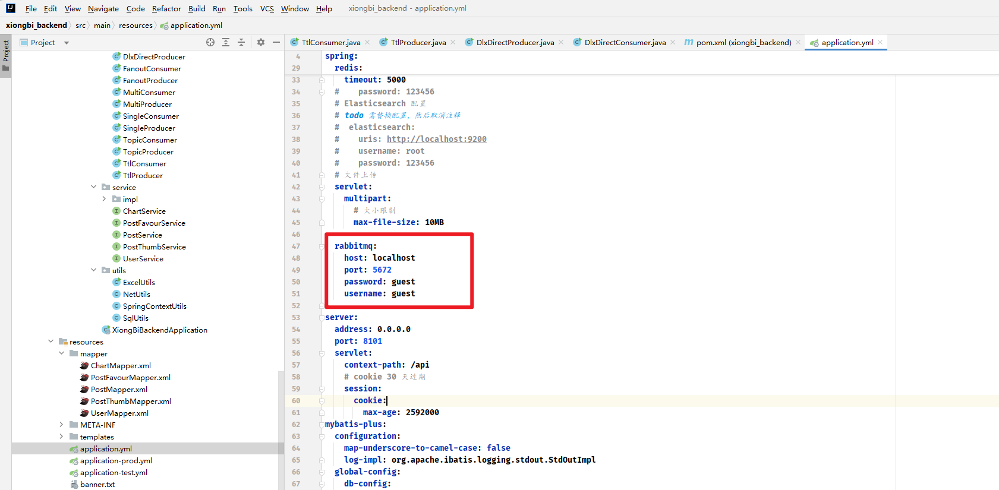


【3】创建交换机和队列


【4】生产者代码


【5】消费者代码


【6】单元测试执行


重启项目，进行监听


发送成功


boot 项目收到消息并消费


**BI项目改造**


以前是把任务提交到线程池，然后在线程池提交中编写处理程序的代码，线程池内排队。

如果程序中断了，任务就没了，就丢了。

改造后的流程：

1. 把任务提交改为向队列发送消息
2. 写一个专门的接受消息的程序，处理任务
3. 如果程序中断了，消息未被确认，还会重发
4. 现在，消息全部集中发到消息队列，你可以部署多个后端，都从同一个地方取任务，从而实现了分布式负载均衡


**实现步骤**


【1】创建交换机和队列


【2】将线程池中的执行代码移到消费者类中


【3】根据消费者的需求来确认消息的格式(chartld)

【4】将提交线程池改造为发送消息到队列


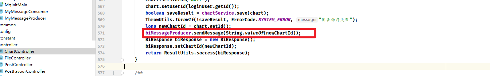


**验证**


验证发现，如果程序中断了，没有ack、也没有nack(服务中断，没有任何响应)，那么这条消息会被重新放到消息队列中，从而实现了每个任务都会执行。


队列和交换机都创建完成

前端要重新生成一下接口


这次调用我们的新接口


来一次


更多优化点：


1. 给任务的执行增加guava Retrying重试机制，保证系统可靠性。
2. 提前考虑到`AI`生成错误的情况，在后端进行异常处理（比如`AI`说了多余的话，提取正确的字符串）
3. 如果说任务根本没提交到队列中（或者队列满了），是不是可以用定时任务把失败状态的图表放到队列中（补偿）
4. 建议给任务的执行增加一个超时时间，超时自动标记为失败（超时控制）
5. 反向压力：https://zhuanlan.zhihu.com/p/404993753,通过调用的服务状态来选择当前系统的策略（比如根据`AI`服务的当前任务队列数来控制咱们系统的核心线程数），从而最大化利用系统资源。
6. 我的图表页面增加一个刷新、定时自动刷新的按钮，保证获取到图表的最新状态（前端轮询）
7. 任务执行成功或失败，给用户发送实时消息通知（实时：websocket、server side event)


1. 支持用户查看图表原始数据
2. 图表数据分表存储，提高查询灵活性和性能
3. 支持分组（分标签）查看和检索图表
4. 增加更多可选参数来控制图表的生成，比如图表配色等
5. 支持用户对失败的图表进行手动重试
6. 限制用户同时生成图表的数量，防止单用户抢占系统资源
7. 统计用户生成图表的次数，甚至可以添加积分系统，消耗积分来智能分析
8. 支持编辑生成后的图表的信息。比如可以使用代码编辑器来编辑Echarts图表配置代码
9. 由于图表数据是静态的，很适合使用缓存来提高加载速度。
10. 使用死信队列来处理异常情况，将图表生成任务置为失败
11. 补充传统`BI`拥有的功能，把智能分析作为其中一个子模块。


撒花。


最后来一些图：


